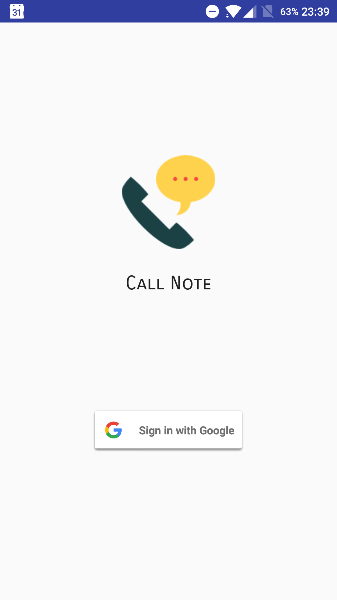
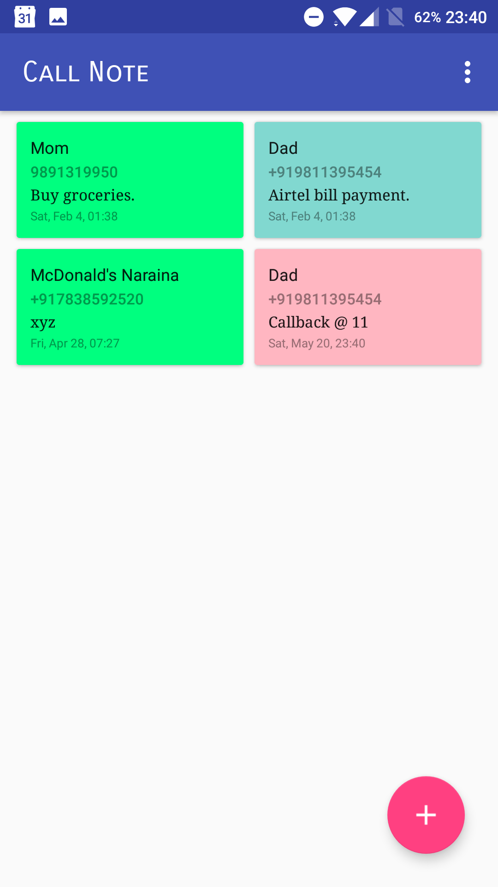
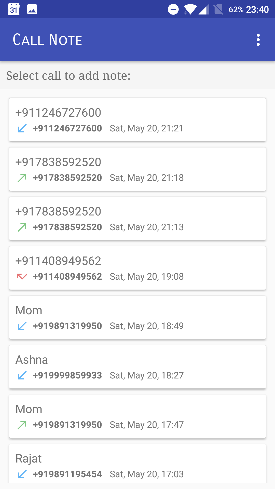
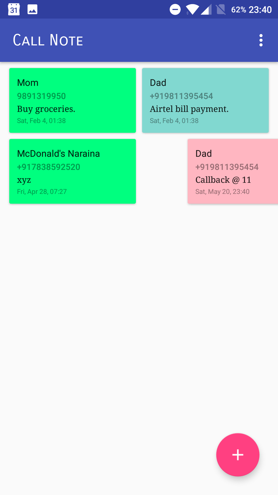
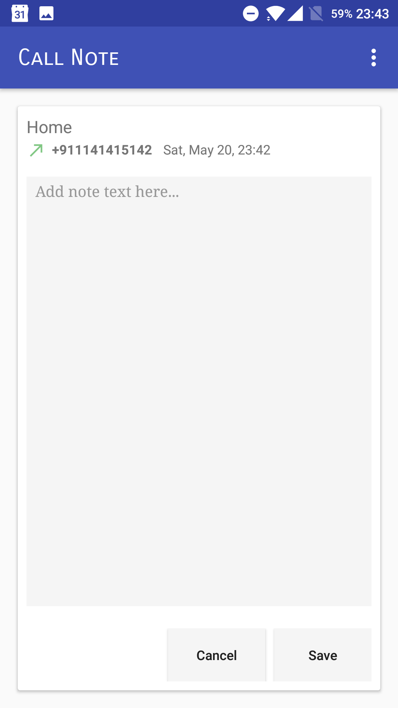

# CallNote
Udacity Android Developer Nanodegree - Capstone Project

CallNote is an android app that allows you to add notes which are linked to your calls.

After every call, a dialog pops up asking you if you would like to add a note or not for that particular call.
You can also add a note for a call from within the app later on by accessing the call log.
All notes are linked to your gmail account so that you can access them from any android device.

NOTE: Replace YOUR_CLIENT_ID with your own client id obtained from the google developer console (OAuth 2.0 WebClient ID)

<b>Screenshots</b>

